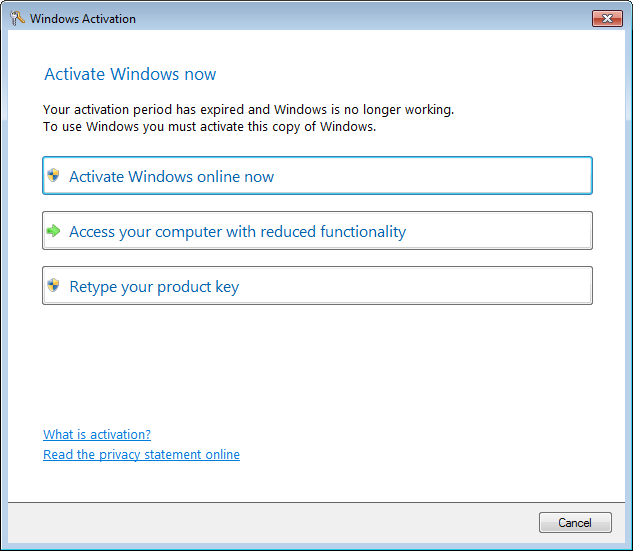

# Fake Windows Activation Client

A fake Windows Activation pop-up programmed to waste scammers' time.



## Running the program

You can copy **slui.exe** whenever you want, ideally where scammers don't usually go.

Every time the program opens or reappears the following processes will be killed: *iexplore*, *msinfo32*, *mmc*, *dxdiag*, *msconfig*, *taskmgr*, *cmd*, *notepad*, *syskey*.

Any product key, except ```5T0PW-4ST1N-GURT1-M35C4-MM1NG``` will take about 8 minutes to verify and the process will always fail, showing a network error. The program will close itself afterwards. You can reopen it either manually or with a script.

In Windows 7, the Task Manager will be closed as soon as it is opened. In Windows 8 and greater you may want to use a PowerShell script to keep this program alive because Task Manager cannot be suppressed any longer, therefore the scammer will most likely kill the program.

## Todo

- [ ] Suppress Task Manager when the program is hidden
- [ ] \(maybe) Reset forms position before hiding them instead of preventing them from being moved
- [x] Verify the secret code as well, but take less time
- [ ] Add a dash every five characters
- [ ] Fix bottom panel weird positioning when using Windows classic theme
