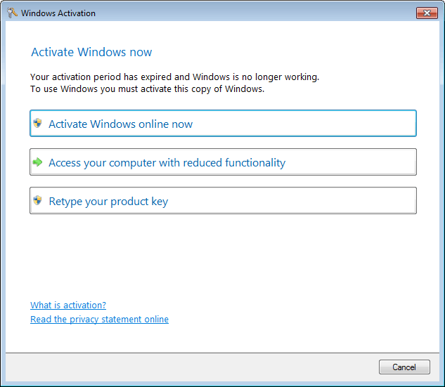

<h1 align="center">
  <br>
  
  <br>
  Fake Windows Activation Client
  <br>
</h1>

<h4 align="center">A fake Windows Activation pop-up programmed to waste scammers' time.</h4>

<p align="center">
  <a href="#getting-started">Getting started</a> •
  <a href="#settings">Settings</a> •
  <a href="#download">Download</a>
</p>

## Getting started

1. Copy **slui.exe** and **INIFileParser.dll** wherever you want, `C:\Windows` for example.
   * Copy **slui.ini** as well or create one if you want to customize fake-slui.
2. Copy the scripts inside the **.\KeepAlive** folder wherever you want.

While fake-slui is running the following processes will be killed:

* cmd
* dxdiag
* explorer
* iexplore
* mmc
* msconfig
* msinfo32
* notepad
* syskey

You can customize the killed processes using a `slui.ini` file. See the [Settings section](#settings) for more information.

If you want to keep fake-slui running, there's a PowerShell script included in this repository that will run fake-slui again when closed. See [How to keep fake-slui running](#how-to-keep-fake-slui-running).

### How to keep fake-slui running

1. Open **1_RunKeepAlive.bat** with a source code editor (e.g. [Notepad++](https://notepad-plus-plus.org/)).
2. Replace `"C:\Path\To\KeepAlive.ps1"` with **the path to the PowerShell script (*KeepAlive.ps1*)**:

```bat
powershell -windowstyle hidden "C:\KeepAlive.ps1"
```

3. Open **2_KeepAlive.ps1** and replace `"C:\PATH\TO\EXECUTABLE\slui.exe"` with **the path to the fake-slui executable (*slui-exe*)**:

```powershell
} else {
    Start-Process -FilePath "C:\Windows\slui.exe"
}
```

4. Edit the `Start-Sleep` value.

```powershell
# Check if 'slui' is running every X seconds
Start-Sleep 120
```

5. To keep fake-slui running, run **RunKeepAlive.bat** with **ELEVATED** privileges.
   * Kill **powershell.exe** (its window is invisible) to interrupt the script.

## Settings

fake-slui can be configured by using a `slui.ini` file. For example, you can decide how much the verification process will take or which processes to kill.

The settings file is optional.

The `slui.ini` file **must** be placed alongside `slui.exe`.

### Elements of slui.ini

#### [slui]

The `slui` section can include the following properties:

<table>
  <tr>
    <th align="left">Property</th>
    <th align="left">Type</th>
    <th align="left">Default</th>
    <th align="left">Description</th>
  </tr>
  <tr>
    <td><code>productkey</code></td>
    <td>String</td>
    <td>5T0PW-4ST1N-GURT1-M35C4-MM1NG</td>
    <td>If typed in fake-slui, the verification process will take 10 seconds to complete.</td>
  </tr>
  <tr>
    <td><code>verificationtime</code></td>
    <td>Integer</td>
    <td>3</td>
    <td>This setting controls how much time the verification process will take (in minutes).</td>
  </tr>
</table>

#### [procstokill]

The `procstokill` section must include the following properties:

<table>
  <tr>
    <th align="left">Property</th>
    <th align="left">Type</th>
    <th align="left">Default</th>
    <th align="left">Description</th>
  </tr>
  <tr>
    <td><code>list</code></td>
    <td>String Array</td>
    <td>
      <details>
        <summary>Click to expand</summary>
        explorer,taskmgr,iexplore,msinfo32,mmc,dxdiag,msconfig,cmd,notepad,syskey
      </details>
    </td>
    <td>
      List of processes to kill as soon as they are opened on the machine.
      <br>
      <b>This property overrides the default array of processes.</b> The processes <b>must be separated by a comma.</b>
    </td>
  </tr>
</table>

### Example slui.ini file

```ini
[slui]
productkey=D0NTW-4ST3Y-0URT1-M35C4-MM1NG
verificationtime=5

[procstokill]
list=explorer,taskmgr,iexplore,chrome,notepad,cmd
```

## Download

You can [download](https://github.com/Strappazzon/fake-slui/releases/latest) the latest version of fake-slui from the Releases page.
