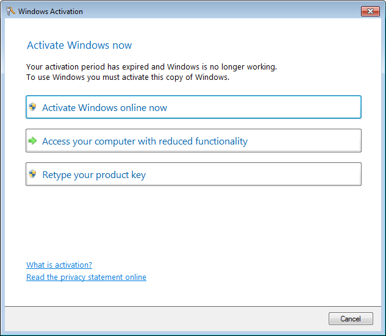

<h1 align="center">
  <br>
  </a>
  <br>
  Fake Windows Activation Client
  <br>
</h1>

<h4 align="center">A fake Windows Activation pop-up programmed to waste scammers' time.</h4>

## Running the program

> You can copy **slui.exe** wherever you want, ideally where scammers don't usually go.

Every time the program opens the following processes will be killed: *iexplore*, *msinfo32*, *mmc*, *dxdiag*, *msconfig*, *cmd*, *notepad*, *syskey*.

While the program is running Task Manager will be killed as soon as it's opened, however this is not possible on Windows 8 and greater. If you are using a different version of Windows and/or you want to reopen fake-slui, you should use the PowerShell script I wrote for this (see [Keeping fake-slui running](#Keeping-fake-slui-running)).

Any product key, except `5T0PW-4ST1N-GURT1-M35C4-MM1NG` will take five minutes to verify and the verification process will always fail. The program will close itself afterwards.

## Keeping fake-slui running

Open **1_Configuration.bat** with a text editor (I recommend [Notepad++](https://notepad-plus-plus.org/)). You will see this piece of code:

```bat
:variables
:: Change this to where you keep KeepAlive.ps1
set KeepAlive="C:\PATH\TO\KeepAlive.ps1"
goto init
```

Modify the string `KeepAlive` with **the path where you want to keep *KeepAlive.ps1***, for example:

```bat
:variables
:: Change this to where you keep KeepAlive.ps1
set KeepAlive="C:\Windows\KeepAlive.ps1"
goto init
```

Save and close the file, then open **2_KeepAlive.ps1** with a text editor. Modify `Start-Process -FilePath` and `Start-Sleep` to your liking, for example:

```powershell
else{
    Start-Process -FilePath "C:\Windows\slui.exe"
}
```

```powershell
Start-Sleep 50 #Check if slui is open every this amount of time (seconds)
```

Save and close the file.

Now that everything is configured you can launch **Configuration.bat** in an **ELEVATED** Command Prompt when you want to keep fake-slui running.

Kill **powershell.exe** (its window is invisible on purpose) to interrupt the script.

## Todo

- [x] Verify the secret code as well, but take less time
- [ ] Add a dash every five characters
- [ ] Fix bottom panel weird positioning when using Windows classic theme
